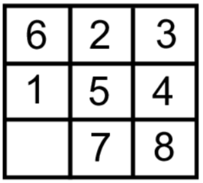

# Informed Search for Puzzle Problem Analysis
Source: https://github.com/aimacode/aima-python

## Step To Analyze
### 1. Open [search4e.ipynb](search4e.ipynb) file
### 2. Click Run All to run all cells
If any cells error except the Puzzle Problem, just ignore it (idk too wkwk)
### 3. Go to 8 Puzzle Problems section
Below of section **KKA problem**, it simulate the algorithms to solve 8 Puzzle problem with runtime and memory analysis.
1. depth limited search (depth limit=50 is fine)
2. breadth first search,
3. A* (h1)
4. A* (h2)

With this initial state

### 4. Analyze each  algorithms
Its your homework bruhh
